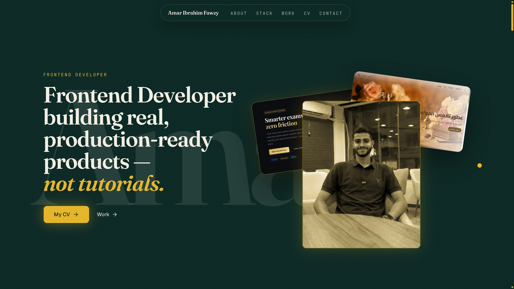
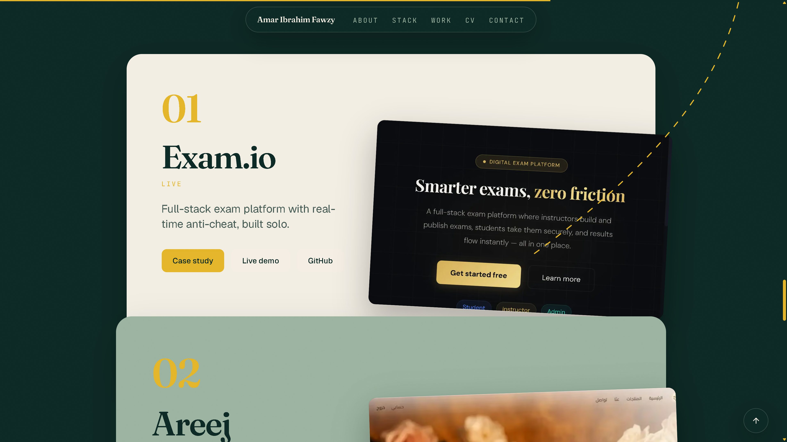
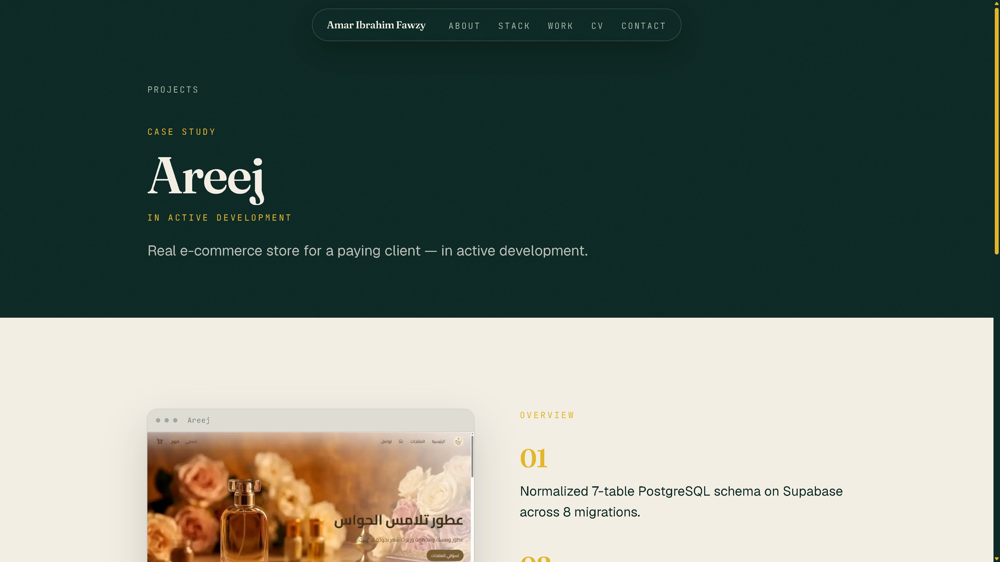
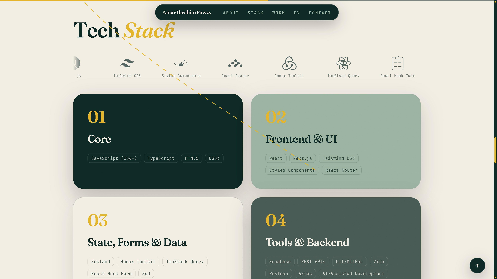

<p align="center">
  <a href="https://portfolio-amaribrahim-1s-projects.vercel.app"><strong>Live site</strong></a>
  &nbsp;·&nbsp;
  <a href="https://linkedin.com/in/amar-ibrahim-47961938a">LinkedIn</a>
  &nbsp;·&nbsp;
  <a href="https://github.com/Amaribrahim-1">GitHub</a>
  &nbsp;·&nbsp;
  <a href="mailto:amaribrahimforwork1@gmail.com">Email</a>
  &nbsp;·&nbsp;
  <a href="https://portfolio-amaribrahim-1s-projects.vercel.app/cv/Amar-Ibrahim-CV.pdf">CV</a>
</p>

# Amar Ibrahim — Portfolio

Personal site for [Amar Ibrahim Fawzy](https://github.com/Amaribrahim-1), a frontend developer based in Egypt. One scrolling homepage plus case-study pages for Exam.io and Areej.

> Frontend Developer building real, production-ready products — not tutorials.

<p align="center">
  <a href="https://portfolio-amaribrahim-1s-projects.vercel.app">
    
  </a>
</p>

<p align="center">
  
  
  
  
  
  
</p>

## Work

<p align="center">
  
  
</p>

| Project | Status | Links |
| --- | --- | --- |
| **Exam.io** — full-stack exam platform with real-time anti-cheat, built solo | Live | [Case study](https://portfolio-amaribrahim-1s-projects.vercel.app/projects/exam-io) · [Demo](https://exam-platform-7r4y.vercel.app) · [Repo](https://github.com/Amaribrahim-1/exam_platform) |
| **Areej** — Arabic/RTL e-commerce store for a paying client | Live | [Case study](https://portfolio-amaribrahim-1s-projects.vercel.app/projects/areej) · [Demo](https://areej-store-kappa.vercel.app/) · [Repo](https://github.com/Amaribrahim-1/areej-store) |
| **Online Bookstore** — storefront with role-based access, search, and cart | Live | [Demo](https://book-store-bay-phi.vercel.app) · [Repo](https://github.com/Amaribrahim-1/Book-Store) |

Bookstore is homepage-only (no case-study route).

## Stack

<p align="center">
  
</p>

- [Next.js](https://nextjs.org) 16 (App Router) and React 19
- TypeScript
- Tailwind CSS v4
- GSAP 3 + ScrollTrigger + Lenis (`@gsap/react`)
- shadcn/ui — `button`, `card`, `badge`, `separator`
- Fonts: Fraunces (display), Geist (body), JetBrains Mono (tags)

Requires **Node.js 20.9+**. Content lives in TypeScript files under `src/content/` — no CMS, database, or contact-form backend.

## Scripts

```bash
npm install
npm run dev      # http://localhost:3000
npm run build
npm run start    # serve the production build
npm run lint
```

## Folder structure

```
src/
  app/                 homepage (`/`), projects archive (`/projects`), case studies (`/projects/[slug]`)
  components/
    sections/          Hero, About, TechStack, Projects, ProjectsIndex, CaseStudy, CvPage, Contact
    shared/            Navbar, Footer, and other non-motion UI
    motion/            Lenis + GSAP ScrollTrigger primitives
    ui/                shadcn primitives
  content/             profile, skills, projects (the site copy)
  lib/                 GSAP register, split-text helper, site URL
public/
  cv/                  Amar-Ibrahim-CV.pdf
  images/              portrait and project screenshots
```

The `/projects` archive lists every project from `src/content/projects.ts`. Case-study slugs come from `hasCaseStudy: true`. Today that is `/projects/exam-io` and `/projects/areej`.

To change copy, projects, or contact links, edit `src/content/*.ts` and redeploy.

## Deploy

Live at **[portfolio-amaribrahim-1s-projects.vercel.app](https://portfolio-amaribrahim-1s-projects.vercel.app)**. Hosted on [Vercel](https://vercel.com); pushes to `main` on [Amaribrahim-1/portfolio](https://github.com/Amaribrahim-1/portfolio) auto-deploy.

`NEXT_PUBLIC_SITE_URL` is set on Vercel to the canonical origin (no trailing slash) so Open Graph tags and the sitemap do not fall back to `http://localhost:3000`.
